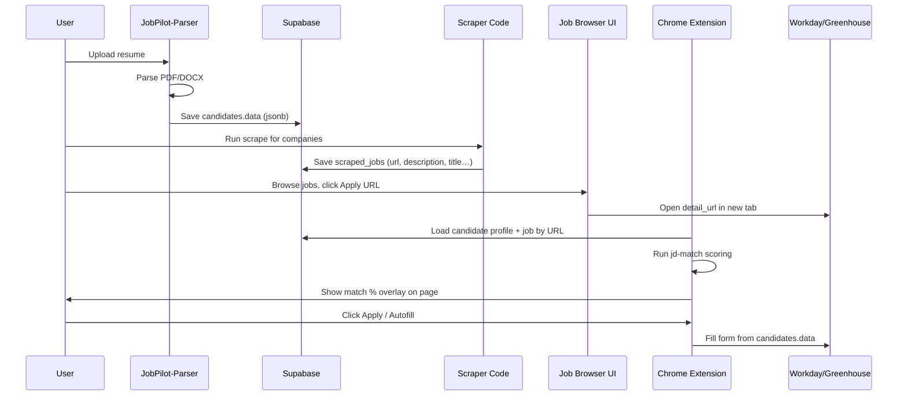

# JobPilot End-to-End Integration Plan

A phased plan to connect all four monorepo projects into one workflow:

**Parse resume → Scrape jobs → Open apply page → Show match score → Autofill application**

---

## Target User Journey



### Steps at a Glance

| Step | Project | Action |
|------|---------|--------|
| **1** | JobPilot-Parser | User uploads resume → parsing → data stored in DB |
| **2** | Scraper Code | Scrape job listings → store URLs + descriptions in DB |
| **3** | Job Browser UI | User clicks job URL → lands on ATS application page |
| **4** | jd-match-scoring | Match JD against parsed profile JSON → show % on screen |
| **5** | job-autofill-scraper | User confirms → extension auto-fills the application form |

---

## Current State vs. Gaps

| Step | Project | Works Today | Gap for Integration |
|------|---------|-------------|---------------------|
| 1 | JobPilot-Parser | Resume parse + save to `candidates` | Needs stable `candidate_id` / email for extension lookup |
| 2 | Scraper Code | Scrapes jobs → `scraped_jobs` with `detail_url` + `description` | No unified job browser tied to logged-in candidate |
| 3 | — | URLs exist in DB | No "Apply" button wired to extension context |
| 4 | jd-match-scoring | Client-side scoring works | Standalone app; not on ATS page; uses summary only, not full parsed JSON |
| 5 | job-autofill-scraper | Workday/Greenhouse autofill works | Separate popup; no match UI; not linked to scraped job URL |

---

## Recommended Architecture

### One Database, Three Clients, One Shared Library

```text
Supabase Postgres
├── candidates          (Step 1 — profile jsonb)
├── companies           (Step 2 — scrape targets)
├── scrape_runs         (Step 2 — run history)
└── scraped_jobs        (Step 2 — jobs + detail_url + description)

Shared npm package: @jobpilot/match-core
└── Port jd-match-scoring/src/lib/* (skillExtractor, matchScorer, taxonomy)

Unified JobPilot Web App (extend current frontend/)
├── /profile            Step 1 — resume upload + edit
├── /jobs               Step 2+3 — browse scraped jobs, match preview, Apply link
└── API gateway         Proxy to Parser API + Scraper API

Chrome Extension (enhanced job-autofill-scraper)
├── Content script      Step 4 — match overlay on ATS pages
└── Popup               Step 5 — autofill + candidate/job context
```

### Why Hybrid (Web + Extension)?

- **Match preview in job list** — use `scraped_jobs.description` already in DB (fast, no DOM scraping).
- **Match on apply page (Step 4)** — extension overlay confirms score on the real page and handles cases where JD differs from stored description.
- **Autofill (Step 5)** — extension already owns DOM access; keep it there.

---

## Step-by-Step Implementation Plan

### Phase 0 — Foundation (1–2 days)

**Goal:** Same Supabase project, shared types, one dev story.

| Task | Details |
|------|---------|
| Single Supabase project | Parser, Scraper, Autofill backend all use same `SUPABASE_URL` + service key |
| Link candidate to user | Add `user_id` or enforce unique `email` on `candidates` |
| Shared TypeScript types | Move `CandidateData` schema to `shared/` package used by frontend + extension |
| Extract `@jobpilot/match-core` | Copy `jd-match-scoring/src/lib/*` into monorepo package; both web app and extension import it |
| Environment docs | One `.env.example` at monorepo root documenting all services |

**Optional new table:**

```sql
CREATE TABLE job_applications (
  id UUID PRIMARY KEY DEFAULT gen_random_uuid(),
  candidate_id UUID REFERENCES candidates(id),
  scraped_job_id TEXT,  -- (company_id, source, job_id) composite or UUID
  detail_url TEXT NOT NULL,
  match_score NUMERIC,
  weighted_match_score NUMERIC,
  match_snapshot JSONB,  -- matched/missing skills at apply time
  status TEXT DEFAULT 'viewed',  -- viewed | applied | skipped
  created_at TIMESTAMPTZ DEFAULT NOW()
);
```

---

### Phase 1 — Step 1: JobPilot-Parser

**Goal:** User uploads resume once; structured JSON lives in DB.

**Flow:**

```text
Upload → POST /resume/parse → UI review → POST /candidates → DB
```

**Enhancements for downstream steps:**

1. **Rich text for matching** — add API field or computed property:

```python
# candidates.data or GET /candidates/{id}/match-text
match_text = summary + skills + work descriptions + project text
```

> jd-match-scoring today only uses `professionalSummary`. For Step 4, feed the **full parsed profile** (summary + skills + experience bullets + education).

2. **Persist `candidate_id` in browser** — localStorage or extension `chrome.storage` after save.

**Acceptance criteria:**

- [ ] Resume parses name, experience, education, skills correctly
- [ ] Profile saved with retrievable `GET /candidates?email=` or `GET /candidates/{id}`
- [ ] `match_text` builder returns one string from all parsed sections

---

### Phase 2 — Step 2: Scraper Code

**Goal:** Scrape jobs; store listing metadata and application URLs.

**Flow:**

```text
Pick company → POST /api/scrape → scraped_jobs rows with detail_url + description
```

**Integration tasks:**

| Task | Owner | Notes |
|------|-------|-------|
| Ensure `description` populated | Scraper plugins | Already in schema; verify Workday detail fetch |
| Normalize `detail_url` | Scraper | Same URL format extension can match later |
| Job list API for unified UI | New or Scraper `GET /api/jobs` | Filter by company, date, keyword |
| Scheduled scrapes (later) | Cron / Supabase Edge | Daily refresh of target companies |

**Existing schema (`scraped_jobs`):**

```sql
CREATE TABLE IF NOT EXISTS public.scraped_jobs (
    run_id          UUID NOT NULL REFERENCES public.scrape_runs(id) ON DELETE CASCADE,
    company_id      TEXT NOT NULL,
    source          TEXT NOT NULL,
    job_id          TEXT NOT NULL,
    title           TEXT NOT NULL,
    location        TEXT,
    country         TEXT,
    date_posted     DATE,
    detail_url      TEXT NOT NULL,
    employment_type TEXT,
    hiring_org      TEXT,
    description     TEXT,
    scraped_at      TIMESTAMPTZ NOT NULL DEFAULT NOW(),
    PRIMARY KEY (company_id, source, job_id)
);
```

**Acceptance criteria:**

- [ ] Scrape run produces rows with non-empty `detail_url` and `description`
- [ ] API returns paginated jobs for the job browser UI

---

### Phase 3 — Step 3: Job Browser + "Apply"

**Goal:** User sees scraped jobs and clicks through to the real ATS apply page.

**Where:** Extend `frontend/` (Parser React app) with a **Jobs** section.

**UI sketch:**

```text
┌─────────────────────────────────────────────────────────┐
│  Jobs for: [NVIDIA ▼]  Filter: [keyword] [location]    │
├─────────────────────────────────────────────────────────┤
│  Senior Backend Engineer · Bangalore · Posted Jul 15    │
│  Match preview: 78%  ●●●●○                              │
│  [View JD]  [Apply →]                                   │
└─────────────────────────────────────────────────────────┘
```

**"Apply" click behavior:**

```typescript
// 1. Store context for extension
chrome.runtime.sendMessage({
  type: 'JOBPILOT_SET_CONTEXT',
  candidateId,
  jobUrl: job.detail_url,
  jobDescription: job.description,  // from DB
  jobTitle: job.title,
});

// 2. Open ATS page
window.open(job.detail_url, '_blank');
```

**Fallback if extension APIs aren't available from the web app** — URL query params:

```text
https://nvidia.wd5.myworkdayjobs.com/.../job/123?jp_candidate=uuid&jp_job=company:workday:123
```

Extension reads query params on page load.

**Acceptance criteria:**

- [ ] Job list loads from `scraped_jobs`
- [ ] Apply opens correct URL in new tab
- [ ] Extension receives candidate + job context

---

### Phase 4 — Step 4: JD Match on Application Page

**Goal:** When user lands on the apply page, show match % on screen.

**Where:** Enhance `job-autofill-scraper` content script.

**Match input construction:**

```typescript
function buildUserMatchText(candidate: CandidateData): string {
  const parts = [
    candidate.profile?.summary,
    candidate.profile?.skills?.join(', '),
    ...candidate.work_experience?.map(w => `${w.title} ${w.description}`),
    ...candidate.education?.map(e => `${e.degree} ${e.field_of_study}`),
  ];
  return parts.filter(Boolean).join('\n');
}
```

**JD source priority:**

| Priority | Source | When |
|----------|--------|------|
| 1 | `scraped_jobs.description` from extension context | User came from Job Browser |
| 2 | DOM extraction on page | Job detail visible on ATS |
| 3 | Extension popup paste | Manual fallback |

**On-page overlay UI:**

```text
┌──────────────────────────────┐
│ JobPilot Match: 82.5%        │
│ ✓ Java, Kafka, AWS           │
│ ✗ Kubernetes, Terraform      │
│ [Apply anyway] [Dismiss]     │
└──────────────────────────────┘
```

Inject as fixed panel (content script + shadow DOM CSS).

**Scoring:** Reuse `@jobpilot/match-core`:

- **Basic score:** `% of JD skills found in profile text`
- **Weighted score:** required skills × 2 (default)

**Optional:** `POST /applications` to log match when overlay shown.

**Acceptance criteria:**

- [ ] Overlay appears on Workday/Greenhouse apply pages within 2s
- [ ] Score uses full parsed JSON, not summary only
- [ ] Shows matched / missing skills
- [ ] Works when user navigates directly (lookup job by URL in DB)

---

### Phase 5 — Step 5: Autofill After User Confirms

**Goal:** If user accepts match, fill the application form.

**Flow:**

```text
User clicks "Apply anyway" / "Autofill" in overlay or popup
  → extension loads candidates.data from API
  → runFillEngine(document, candidateData)
  → show fill summary (filled / skipped / failed)
```

**UX on overlay:**

```text
Match: 82.5%  →  [Autofill application]
```

Reuse existing fill engine (`scraper/src/fill-engine/`):

| Platform | Scanner |
|----------|---------|
| Workday | `data-automation-id` mappings |
| Greenhouse | Label scanner |

**Handlers:** text, dropdown, multiselect, repeatable sections, checkbox, file (skip + highlight).

**Post-fill:**

- Update `job_applications.status = 'applied'`
- Toast: "Filled 24/28 fields — upload resume manually"

**Acceptance criteria:**

- [ ] One click from match overlay triggers autofill
- [ ] Uses same candidate saved in Step 1
- [ ] File upload fields highlighted for manual action

---

## API Additions Summary

| Service | Endpoint | Purpose |
|---------|----------|---------|
| Parser API | `GET /candidates/{id}/match-text` | Concatenated text for scoring |
| Parser API | `GET /candidates/me` | Current user's profile (auth) |
| Scraper API | `GET /api/jobs?company_id=&q=` | Job browser feed |
| Scraper API | `GET /api/jobs/by-url?url=` | Lookup JD by apply URL |
| Autofill API | `GET /candidates?email=` | Already exists |
| New (optional) | `POST /applications` | Log match + apply events |

---

## Monorepo Layout (Target)

```text
D:\JobPilot\
├── docs/
│   └── INTEGRATION_PLAN.md     ← this file
├── packages/
│   ├── match-core/             # from jd-match-scoring/src/lib
│   └── shared-types/           # CandidateData, ScrapedJob
├── jobpilot/                   # Parser backend (Step 1)
├── frontend/                   # Unified UI: Profile + Jobs (Steps 1, 3)
├── Scraper Code/               # Scraper backend (Step 2)
├── job-autofill-scraper/       # Extension + API (Steps 4, 5)
└── jd-match-scoring/           # dev sandbox (logic moves to match-core)
```

---

## Implementation Phases & Timeline

| Phase | Scope | Effort | Deliverable |
|-------|--------|--------|-------------|
| **0** | Shared DB, types, match-core package | 1–2 days | Foundation |
| **1** | Parser hardening + `match_text` | 2–3 days | Step 1 complete |
| **2** | Scraper API for job list + URL lookup | 2–3 days | Step 2 complete |
| **3** | Jobs page + Apply link + extension context | 3–4 days | Step 3 complete |
| **4** | Extension match overlay | 4–5 days | Step 4 complete |
| **5** | Overlay → autofill + apply logging | 2–3 days | Step 5 complete |
| **6** | Auth, polish, E2E tests | 3–5 days | Production-ready |

**Total estimate:** ~3–4 weeks for MVP end-to-end flow.

---

## Critical Technical Decisions

### 1. Where does match scoring run?

**Recommendation:** Client-side in the extension (and optionally in job list for preview). No ML server needed; reuse existing TypeScript logic from `jd-match-scoring`.

### 2. How to link web app click → extension on ATS tab?

**Recommendation (in order):**

1. `chrome.runtime.sendMessage` from web app (if permitted)
2. URL query params `?jp_candidate=&jp_job=`
3. Extension matches `detail_url` against `scraped_jobs` via backend API

### 3. One app or four separate apps?

**Recommendation:** One **unified frontend** (Profile + Jobs) + **one enhanced extension**. Keep Parser and Scraper as separate backends initially; merge APIs later if needed.

### 4. Match before or after opening URL?

**Both:**

- **Before:** preview in job list (better UX, uses stored `description`)
- **After:** overlay on apply page (matches Step 4 requirement)

---

## Risks & Mitigations

| Risk | Mitigation |
|------|------------|
| JD on apply page ≠ scraped description | DOM fallback + store match snapshot at click time |
| Workday apply URL differs from listing URL | Normalize URLs; store both listing + apply URLs if needed |
| Extension not installed | Job browser shows "Install extension to autofill" |
| CORS between web app and APIs | Single Vite proxy or API gateway |
| Scanned PDFs parse poorly | Warn in Step 1; match still works on whatever text was extracted |
| Multiple candidates / users | Auth + `candidate_id` in session |

---

## MVP Definition of Done

- [ ] User uploads resume → profile in Supabase
- [ ] Scraper populates `scraped_jobs` with URLs + descriptions
- [ ] Job browser shows jobs with match preview %
- [ ] Click Apply → ATS page opens
- [ ] Extension shows match overlay on ATS page
- [ ] User clicks Autofill → form filled from saved profile
- [ ] Apply event logged (optional `job_applications` table)

---

## Suggested Build Order

1. **match-core package** + `buildUserMatchText()` from full JSON
2. **Job list API** + Jobs page with preview scores
3. **Extension context passing** (URL params or messaging)
4. **Match overlay** in content script
5. **Wire overlay → autofill** (existing engine)
6. **E2E test:** resume → scrape → apply NVIDIA mock → see score → autofill

---

## Running the Stack Today (Dev)

```powershell
# Step 1 — Parser API
cd D:\JobPilot
.venv\Scripts\uvicorn jobpilot.api.main:app --reload --port 8002

# Step 1 — Parser UI
cd D:\JobPilot\frontend
npm run dev

# Step 2 — Scraper API
cd "D:\JobPilot\Scraper Code"
.venv\Scripts\uvicorn server.main:app --reload --port 8000

# Step 4/5 — Autofill API + extension
cd D:\JobPilot\job-autofill-scraper
npm install
npm run build
npm run dev:backend
# Load extension from job-autofill-scraper/extension/ in Chrome

# Step 4 — Match scoring (standalone sandbox)
cd D:\JobPilot\jd-match-scoring
npm install
npm run dev
```

---

## Related Documentation

| Project | README |
|---------|--------|
| JobPilot-Parser | [`../README.md`](../README.md) |
| jd-match-scoring | [`../jd-match-scoring/README.md`](../jd-match-scoring/README.md) |
| job-autofill-scraper | [`../job-autofill-scraper/README.md`](../job-autofill-scraper/README.md) |
| Scraper Code | [`../Scraper Code/README.md`](../Scraper%20Code/README.md) |
| Monorepo upstream | [`../_upstream_jobpilot/README.md`](../_upstream_jobpilot/README.md) |
